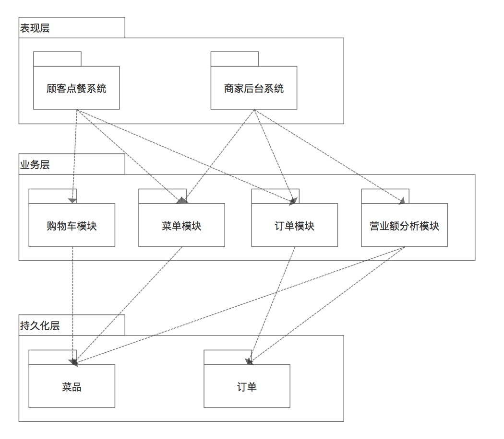

#homework8
----

###1.描述软件架构与框架之间的区别与联系

软件架构：软件架构是一个系统的草图。软件架构描述的对象是直接构成系统的抽象组件。各个组件之间的连接则明确和相对细致地描述组件之间的通讯。在实现阶段，这些抽象组件被细化为实际的组件，比如具体某个类或者对象。在面向对象领域中，组件之间的连接通常用接口来实现。

软件框架：软件框架是指在一定的设计原则基础上，从不同角度对组成系统的各部分进行搭配和安排，形成系统的多个结构而组成架构，它包括该系统的各个组件，组件的外部可见属性及组件之间的相互关系。组件的外部可见属性是指其他组件对该组件所做的假设。

区别：框架是一种软件、半成品。架构不是软件，而是关于软件如何设计的重要策略。

联系：架构可以以框架的方式实现，所以软件架构可以借助已存在的框架来构造。

###2.以你的项目为案例
* 绘制三层架构模型图，细致到分区

* 结合你程序的结构，从程序员角度说明三层架构给开发者带来的便利
	1. 开发人员可以只关注整个结构中的其中某一层；
	2. 可以很容易的用新的实现来替换原有层次的实现；
	3. 可以降低层与层之间的依赖；
	4. 有利于标准化；
	5. 利于各层逻辑的复用。

###3.研究 VUE 与 Flux 状态管理的异同
VUE：它采用集中式存储管理应用的所有组件的状态，并以相应的规则保证状态以一种可预测的方式发生变化。提供了诸如零配置的 time-travel 调试、状态快照导入导出等高级调试功能。

Flux：Flux是一套架构模型，将Web应用的各个主要功能以组件的形式进行划分，并进一步划分子组件。而各组件又以动作、存储器和视图来进行架构分层。

联系：vuex是flux的一种实现

区别：VUE是一个构建数据驱动的web界面的渐进式框架。 
Flux是一种前端状态管理架构思想。